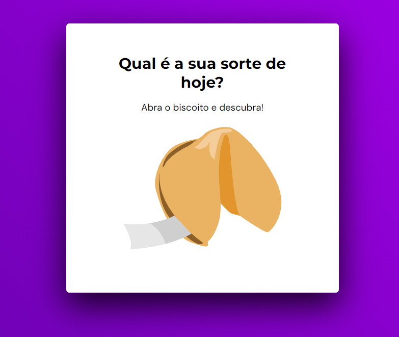

# Biscoito da Sorte - Site de Mensagens Inspiradoras 🥠✨
Este é um simples e encantador site do "Biscoito da Sorte" que oferece mensagens inspiradoras e positivas ao abrir um biscoito virtual. O site foi desenvolvido utilizando HTML, CSS e JavaScript para proporcionar uma experiência interativa e motivadora para os usuários.

 

  
  

Funcionalidades
Ao acessar o site, você é recebido com uma mensagem de boas-vindas e um convite para descobrir sua sorte do dia.
Clique na imagem do biscoito para revelar uma mensagem inspiradora aleatória.
Pressione a tecla "Enter" para abrir o biscoito e obter sua mensagem.
Após abrir o biscoito, a mensagem é exibida juntamente com uma imagem representativa.
Você pode clicar no botão "Abrir outro biscoito" para revelar uma nova mensagem.
Como executar o projeto
Faça o download ou clone este repositório em seu computador.
Abra o arquivo index.html em seu navegador da web para visualizar o site.
Estrutura do Projeto
index.html: Contém a estrutura HTML do site e a marcação para as telas iniciais e de mensagem.
style.css: Arquivo CSS que define a estilização e a aparência do site.
main.js: Código JavaScript que controla a lógica de exibição das mensagens e a interatividade do usuário.
Contribuição
Se você deseja contribuir para este projeto, fique à vontade para abrir uma issue ou enviar um pull request. Sua contribuição é muito bem-vinda!

Autor
Tiago Lucas da Silva - Desenvolvedor(a) e apaixonado(a) por inspirar pessoas.
Agradecimentos
Agradecemos por visitar o "Biscoito da Sorte" e esperamos que as mensagens inspiradoras tragam um sorriso ao seu rosto e positividade ao seu dia. Divirta-se abrindo os biscoitos e compartilhando as mensagens com seus amigos e familiares! 🌈✨